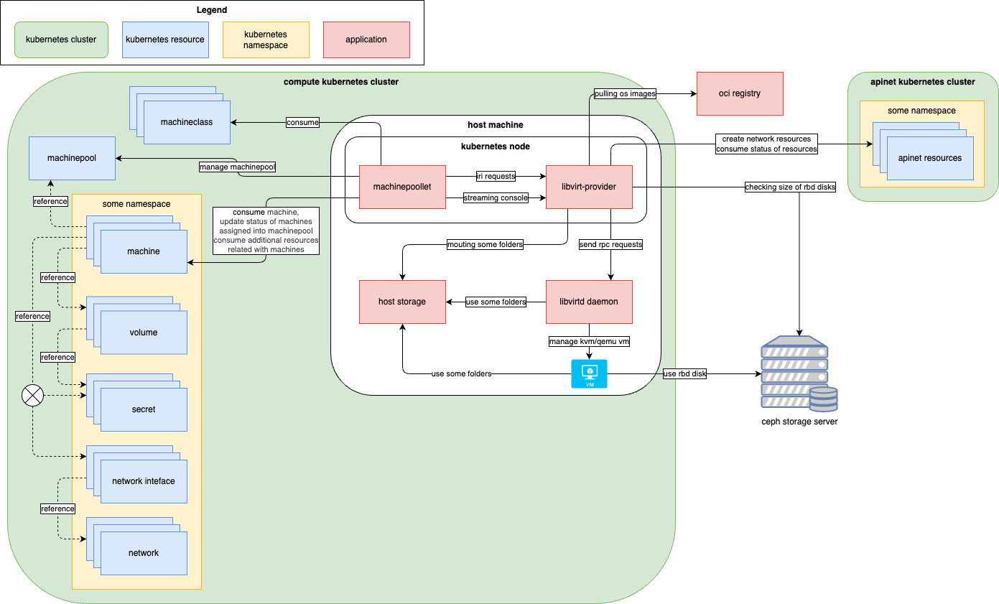

# High-level Architecture

This documentation describes the high-level architecture of the libvirt-provider.
It mainly outlines the dependencies between libvirt-provider and other systems.

## Components

|  |
| :---: |
| *High-level architecture design of components related to the libvirt-provider* |

### libvirt-provider

The `libvirt-provider` is an implementation of the `ironcore runtime interface` (`IRI`) for `Machines`.
It implements the [MachineRuntime][machineRuntime].

It is responsible for managing virtual machines over the libvirt daemon.

The component diagram with descriptions is available in the [components guide](./components.md)

### Libvirt (Daemon)

The [libvirt][libvirt] toolkit is used to manage virtualization platforms.

### Machinepoollet

Machinepoollet is software built on top of the libvirt-provider
that communicates with the Kubernetes cluster and manages resources inside the Kubernetes cluster.

Machinepoollet manages the machine pool in the Kubernetes cluster.
It is primarily responsible for updating the status of machines assigned in the machine pool
and calculating the availability of machine classes for the machine pool.

It converts machine resources and related objects into IRI protocols
and communicates with the libvirt-provider to retrieve the desired state of virtual machines
as defined by the machine resources in the Kubernetes cluster.

The [Streaming Console][streamingConsole] is used for exposing the VM console over the network.

More information can be found in the [official documentation][machinepoolletDocs].

### OCI Registry

The [OCI Registry][ociRegistry] serves as storage for OS images for direct kernel boot.

OS images can be created using the [ironcore-image][ironcoreImage] tool.

### Host Storage

The host storage represents the filesystem on the host machine where the libvirt-provider is running.

Some folders from host storage are shared between multiple applications (libvirt-provider, libvirt daemon, etc.).
These shared folders facilitate "communication" between components, and they are critical for some features of the libvirt-provider.
This is the reason why both the libvirt-provider and the libvirt daemon must always run on the same host machine.

Example of a shared folder:
A direct-boot kernel requires an OS disk,
which is downloaded by the libvirt-provider and used by the libvirt daemon or virtual machine (qemu processes).

### Apinet Cluster

The Apinet cluster manages network-related resources. Network interfaces are especially important for the libvirt-provider.
The libvirt-provider primarily creates network interface resources within the Apinet cluster,
which are then processed by other components of the Apinet cluster.
After processing, the libvirt-provider consumes the status,
which may contain information important for creating a VM (e.g., PCI address for a network card).

This is an optional solution, and it is used with the command-line argument: `--network-interface-plugin-name=apinet`.

### Ceph Storage

Ceph storage can be used as additional storage space for virtual machines.

We support attaching block devices represented by Ceph images over the [RBD protocol][rbdProtocol].

Ceph images can be used as OS disks or additional storage disks.

---

[rbdProtocol]: <https://docs.ceph.com/en/reef/rbd/>
[machinepoolletDocs]: <https://gitlab.devops.telekom.de/cas-devs/osc/upstream/ironcore-dev/ironcore/-/blob/osc/main/docs/README.md>
[ociRegistry]: <https://opencontainers.org/posts/blog/2024-03-13-image-and-distribution-1-1/>
[ironcoreImage]: <https://github.com/ironcore-dev/ironcore-image>
[libvirt]: <https://libvirt.org/docs.html>
[machineRuntime]: <https://github.com/ironcore-dev/ironcore/blob/main/iri/apis/machine/v1alpha1/api.proto>
[streamingConsole]: <https://gitlab.devops.telekom.de/cas-devs/osc/upstream/ironcore-dev/ironcore/-/blob/osc/main/docs/concepts/machine-exec-flow.md>
