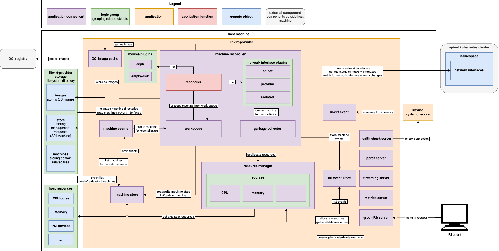

# Libvirt-provider Components

This documentation describes the main components of `libvirt-provider` and their inter-connections.

- [Libvirt-provider Components](#libvirt-provider-components)
    - [Component Diagram](#component-diagram)
    - [Machine Reconciler](#machine-reconciler)
        - [Garbage Collector](#garbage-collector)
        - [Work Queue](#work-queue)
        - [Network Interface Plugins](#network-interface-plugins)
    - [Volume Plugins](#volume-plugins)
    - [Resource Manager](#resource-manager)
        - [Sources](#sources)
    - [Libvirt Event](#libvirt-event)
    - [Machine Store](#machine-store)
    - [Machine Events](#machine-events)
    - [IRI Event Store](#iri-event-store)
    - [OCI Image Cache](#oci-image-cache)
    - [Servers](#servers)
        - [Metrics Server](#metrics-server)
        - [gRPC (IRI) Server](#grpc-iri-server)
        - [Streaming Server](#streaming-server)
        - [Health Check Server](#health-check-server)
        - [PPROF Server](#pprof-server)
    - [Related Components](#related-components)

## Component Diagram

|  |
| :---: |
| *Component diagram of main libvirt-provider components* |

## Machine Reconciler

**Logger name:** machine-reconciler

The Machine Reconciler in the `libvirt-provider` project is a core controller responsible for managing the lifecycle of virtual machines (VMs) on the host. It follows controller pattern used in [Kubernetes](https://kubernetes.io/docs/concepts/architecture/controller/) and ensures that the actual state of VMs on the host matches the desired state as defined by higher-level orchestration `ironcore runtime interface` (`IRI`). The reconciler handles creation, updates, and deletion of VMs, as well as periodic reconciliation to maintain consistency.

**Main responsibilities** of machine reconciler:

- **Reconciliation Loop:** Watches for changes in the machine store or is triggered by events (described below), and brings VMs to the desired state.
    - *Changes in the machine store* (such as creation, update, or deletion of a VM object)
    - *Events from the libvirt event handler* (e.g., device added/removed, disk or metadata changes)
    - *Volume or network interface plugin events* (such as volume resize or network changes)
    - *Image cache events* (e.g., when a required VM image is pulled and ready)
    - *Periodic triggers from background processes* (like the garbage collector or scheduled resyncs)
    - *External gRPC requests* (such as create, update, or delete machine operations via the API)
- **VM Lifecycle Management:** Provisions new VMs, applies changes to running VMs, and handles graceful shutdown and cleanup of VMs using garbage collector.
- **Volume and Network Management:** Integrates with pluggable volume and network interface plugins to attach/detach storage and configure networking for VMs.
- **Metrics and Observability:** Exposes metrics (via Prometheus) for VM state, reconciliation performance, and queue health.
- **Queue Management:** Uses a rate-limiting work-queue to process reconciliation tasks efficiently and handle retries on failure.

### Garbage Collector

**Logger name:** garbage-collector

The garbage collector is a background process within the machine reconciler. It periodically scans for VMs marked for deletion and handles everything related to machine graceful shutdown/deletion: the cleanup of resources associated with these machines, such as deallocating host resources and removing related files from the host file system. If the machine fails to shut down gracefully within the pre-configured grace period, domain is forcefully destroyed. The garbage collector runs in a loop with configurable interval. Flags for configuration are described in the usage document under [garbage collection](../usage/usage.md#garbage-collection).

### Work Queue

The work queue is a part of reconciler that schedules and manages tasks for VM reconciliation. It receives notifications from various sources when a machine needs attention and ensures that all changes are processed in a controlled, reliable, and efficient manner. This allows the system to handle multiple events and retries without losing track of any required actions. This component is beneficial during debugging because it provides distinct metrics, such as the time it takes to process an item in the work queue or the total number of retries, among others.

### Network Interface Plugins

Network interface plugins in `libvirt-provider` manage the creation, configuration, and lifecycle of network interfaces of VMs. Currently, three network plugins are available:

- **Isolated** disables network, primarily used for development.
- **Providernet** manages network over libvirt daemon networks.
- **APINet** manages network over APINet.

## Volume Plugins

Volume plugins provide an interface for managing storage volumes in this project. Each plugin has its own specific features. Currently two plugins are implemented:

- **ceph** handles attaching of ceph disks.
- **empty-disk** handles volumes on host machine.

## Resource Manager

**Logger name:** resource-manager

The resource manager serves as a manager of sources (described below) and provides unified interface for tracking, allocating, and managing host resources. It utilizes sources to get the current state of all managed machines, updates resource assignments, and more. It ensures that resource usage is accurately reflected and that new VMs can only be created if sufficient resources are available, helping to prevent overcommitment of resources (overcommitment of CPUs is supported) and maintain system stability.

Resource manager-specific features are described in the [features guide](../usage/features.md#resource-manager-related), and its configuration flags are documented under [resource manager](../usage/usage.md#resource-manager) in the usage guide.

### Sources

**Logger name:** SourceCPU, SourceMemory, SourcePCI, ...

In the resource manager design, each "source" is a sub-component that knows how to discover, track, and manage a specific type of host resource (such as CPU, memory, PCI devices, etc.). When the resource manager starts, it initializes all registered sources. Each source keeps track of the resources it manages and updates its internal state as resources are allocated or released.

## Libvirt Event

**Logger name:** libvirt-event

The libvirt event handler subscribes to various `libvirt` domain events (such as device added/removed, disk or metadata changes, etc.) and processes them. For each event, it checks if the affected domain (VM) is managed by `libvirt-provider`, updates relevant Prometheus metrics, and requeues the machine for reconciliation if needed. This ensures that changes in the VM state or configuration are detected and handled.

## Machine Store

**Logger name:** store

The machine store is a persistent storage component used to manage the lifecycle and state of VM objects. It is initialized with a directory on the host filesystem and provides methods for creating, updating, listing, and watching machines. The machine store acts as a source of truth of machine state and is used to ensure that both resource management and event handling are always in sync with the actual state of managed VMs. Root folder is configurable and defaults to
`~/.libvirt-provider`. There are three sub-directories that store the VM related data:

- **machines** storing domain related files.
- **store** storing management metadata (API Machine).
- **images** storing OS images pulled from OCI registry.

## Machine Events

**Logger name:** machine-events

The machine events component performs two functions to ensure the correct state of VMs.

- It periodically retrieves a list of machines from the machine store to reconcile VMs.
- It listens for specific events emitted by the machine store. These events signal changes or updates that require attention. Upon receiving such events, the component adds the affected VMs to the work queue for reconciliation.

## IRI Event Store

**Logger name:** iri-event-store

The IRI event store system captures and stores important events related to VMs, such as status changes or errors. It provides a way for other components to record events. The event store maintains a recent history of events, enabling IRI clients and monitoring tools to retrieve and respond to them.

## OCI Image Cache

**Logger name:** oci-local-cache

The OCI image registry is used to store and retrieve VM images. The image cache manages downloading, storing, and serving these images to other components. When an image is needed, the cache ensures it is available locally and notifies interested components when the image is ready, enabling smooth VM creation.

## Servers

Several servers are initiated and started during startup of the `libvirt-provider` application. They listen on configurable addresses and support graceful shutdown. Their settings can be changed via flags, which are documented under [server and health monitoring](../usage/usage.md#server-and-health-monitoring) in the usage guide.

### Metrics Server

**Logger name:** metrics-server

The metrics server exposes internal `libvirt-provider` metrics in Prometheus format. These metrics can be visualized in Grafana dashboards. An overview of exposed metrics is provided in the [metrics guide](../usage/metrics.md). For clarity, connections to the metrics server are omitted from the component diagram.

### gRPC (IRI) Server

**Logger name:** iri-server

The gRPC server handles IRI requests for managing VMs and related resources. It allows clients to create, delete, and list machines, as well as attach or detach volumes and network interfaces, among other operations. The server implements the gRPC protocol defined in the [Machine API protobuf](https://github.com/ironcore-dev/ironcore/blob/main/iri/apis/machine/v1alpha1/api.proto) and listens on a configurable Unix socket.

### Streaming Server

**Logger name:** streaming-server

The streaming server is an HTTP server responsible for handling streaming connections. It is used for providing interactive console access to VM over the network.

### Health Check Server

**Logger name:** healthcheck-server

The health check server provides an endpoint for health checks and probes. It verifies the connection to `libvirt` running on the host machine. This feature is currently under development. The server runs on configurable address and exposes the `/healthz` endpoint.

### PPROF Server

**Logger name:** pprof

The PPROF server is used for debugging. It serves runtime profiling data in the format expected by the pprof visualization tool. Endpoints are available under `/debug/pprof/`, allowing tools like pprof to collect and analyze CPU, memory, and other runtime metrics.

## Related Components

A high-level architecture design of components related to the `libvirt-provider` can be found in the [architecture overview](./README.md).
